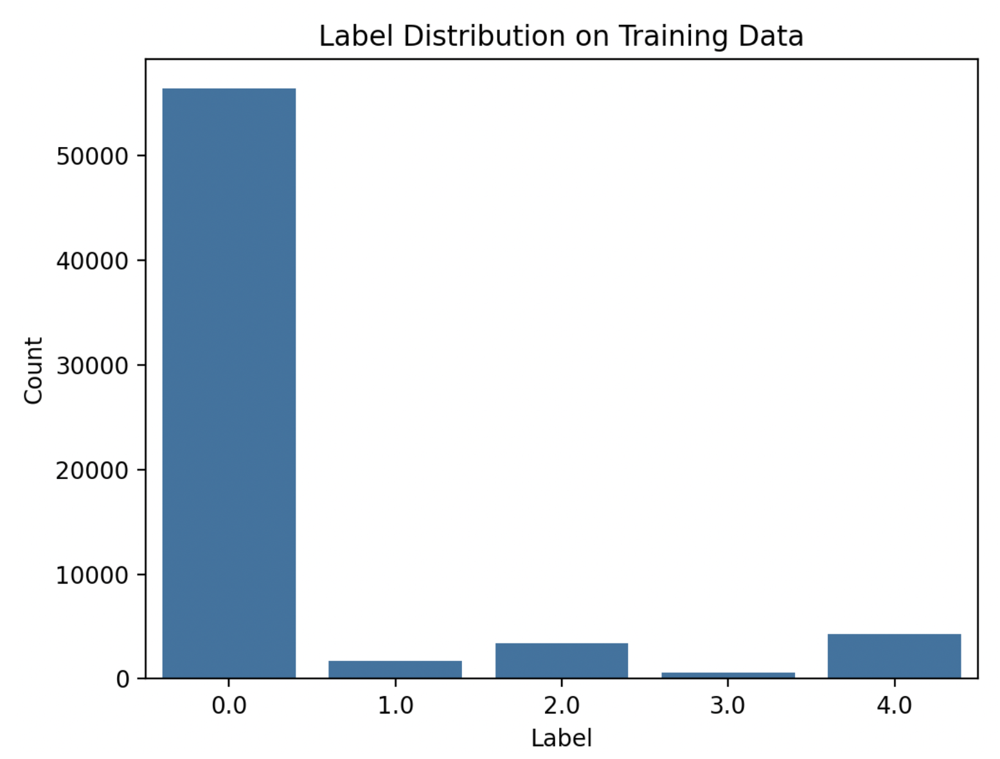

# Deep Neural Networks for the Classification of Single ECG Signals

- [Deep Neural Networks for the Classification of Single ECG Signals](#deep-neural-networks-for-the-classification-of-single-ecg-signals)
  - [Problem Description](#problem-description)
  - [Dataset Used](#dataset-used)
  - [Possible Solutions](#possible-solutions)
    - [Steps](#steps)
    - [Modelli](#modelli)
  - [Metrics Used to Evaluate the Performance](#metrics-used-to-evaluate-the-performance)
  - [Cose Aggiuntive che Potrei Fare](#cose-aggiuntive-che-potrei-fare)

**Nome dello studente:** Alessio Guarachi

## Problem Description

Classificazione di singolo segnale ECG (elettrocardiogramma) in 5 possibili classi. In particolare, lo scopo è di classificare le varie aritmie cardiache.

## Dataset Used

**ECG Heartbeat Categorization Dataset**: Questo dataset di Kaggle è composto da due dataset. Io ho deciso di lavorare con il seguente dataset: **the MIT-BIH Arrhythmia Dataset** siccome i due dataset sono diversi, per quanto riguarda il numero delle classi.

Il dataset è già suddiviso in train e test:

- **Numero di segnali:** 109,446 (training + test)
- **Numero di classi:** 5
  - 0: "Normal Beats"
  - 1: "Supraventricular Ectopy Beats"
  - 2: "Ventricular Ectopy Beats"
  - 3: "Fusion Beats"
  - 4: "Unclassifiable Beats”

La distribuzione nel test set è simile.

## Possible Solutions

### Steps

1. **Splitting del training set** in una parte di validation per il tuning degli iperparametri:
   - Numero di hidden layers
   - Numero di filtri
   - Batch size
   - Ottimizzatore
2. **Normalizzazione dei dati**.

### Modelli

1. **Convolutional Neural Network (1D)** con Batch Normalization e Dropout layers.
2. **2 modelli CNN (in serie)**, uno per l’anomaly detection e uno per la classificazione delle classi anomale.
3. **Recurrent Neural Network (GRU e LSTM)**.
4. Se ho tempo, potrei implementare un **Autoencoder** per l’anomaly detection e successivamente classificare il segnale anomalo.

Siccome il dataset è altamente non bilanciato, utilizzerò anche:

- una **loss pesata**, in modo tale che anche le classi minoritarie abbiamo un contributo alla loss totale.

Confronterò le performance dei modelli con altri modelli che sono stati sviluppati sullo stesso dataset.

## Metrics Used to Evaluate the Performance

- **Precision**
- **Recall**
- **F1 Score** 
  - per ogni classe, per poi fare la media
- **ROC Curve** per le diverse classi

## Cose Aggiuntive che Potrei Fare

Volevo anche fare un confronto in termini di costo computazionale (o latenza) dei diversi migliori modelli, siccome è importanza per una possibile traslazione clinica. 

- **Commento:** Non so ancora come i modelli vengono analizzati sotto questo punto di vista e lo potrei fare se riesco ad ottenere buoni risultati sulle diverse classi.
